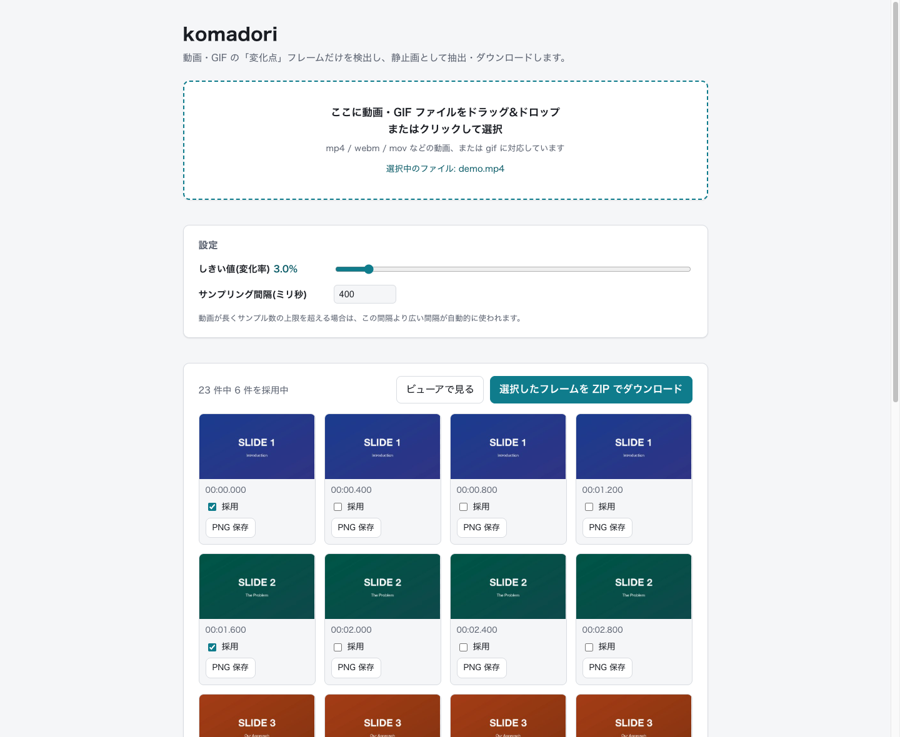

# komadori

komadori is a client-side web app that detects "change point" frames in videos and GIFs and lets you export them as PNG images (individually or as a ZIP). Everything runs in your browser — no files are ever uploaded. Documentation below is in Japanese.

動画やGIFから「変化点」フレームだけを検出し、静止画(PNG)として抽出・ダウンロードできるWebアプリです。読み込みから変化点の検出、ZIP生成まで、すべてブラウザの中だけで完結します。ファイルはどこにも送信されません。



## 特徴

- 動画(mp4 / webm / movなど)とGIFに対応
- スライドの切り替わりのような「変化点」フレームだけを自動で採用
- しきい値スライダーを動かすと、再デコードなしでその場で採用結果を再計算
- フレームビューアで拡大確認しながら採用/除外を調整
- 採用フレームを個別PNGまたはまとめてZIPでダウンロード
- 完全クライアントサイド。ファイルはサーバーに送信されません

## クイックスタート

Node.js v20.19.5以降を想定しています([mise](https://mise.jdx.dev/)を使っている場合は`mise install`で入ります)。

```bash
npm install
npm run dev
```

表示されたURLをブラウザで開き、動画またはGIFファイルをドラッグ&ドロップするだけです。

## ドキュメント

- [使い方ガイド](docs/usage.md) — 画面の操作、フレームビューア、設定項目、注意事項
- [仕組み](docs/architecture.md) — 変化点検出アルゴリズムと内部設計
- [開発ガイド](docs/development.md) — npm scripts、技術構成、ディレクトリ構成
