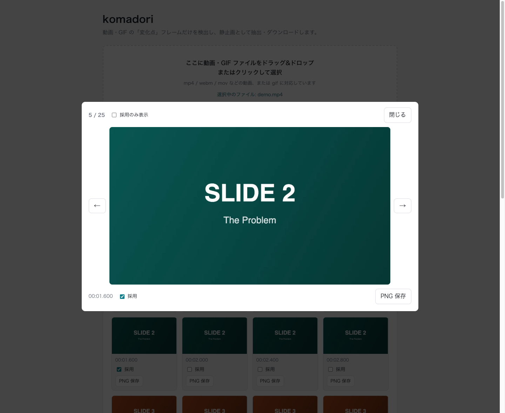

# 使い方ガイド

## 基本の流れ

1. https://komadori.orukubami.sh をブラウザで開きます(ローカルで動かす場合は`npm run dev`で開発サーバーを起動し、表示されたURLを開きます)。
2. 画面上部の入力エリアに、動画(mp4 / webm / movなど、ブラウザが再生できる形式)またはGIFファイルをドラッグ&ドロップするか、クリックしてファイルを選択します。
3. ファイルの読み込みが始まると、一定間隔でフレームをサンプリングしながら進捗バーが表示されます。途中で止めたい場合は「キャンセル」を押すと、その時点までに取得できたフレームで結果一覧が作られます。
4. スキャンが終わると、サンプリングされた全フレームがサムネイル一覧に並びます。「変化点」と判定されたフレームは採用チェックボックスがONの状態で表示されます。
5. 「しきい値(変化率)」スライダーを動かすと、**動画やGIFを読み直すことなく**、その場で採用結果が再計算されます。しきい値を上げるほど大きな変化だけが採用され、下げるほど小さな変化も拾うようになります。
   - しきい値を変更すると、手動で切り替えたチェックボックスの状態はリセットされ、新しいしきい値での自動判定結果に戻ります。
6. 各フレームの採用/除外は、チェックボックスで手動でも切り替えられます。結果一覧ヘッダの「全選択」「全解除」ボタンを使うと、フレーム数が多いときも1枚ずつクリックせずに一括で切り替えられます(全件が採用中のときは「全選択」が、採用が0件のときは「全解除」が無効になります)。
7. 一覧の各フレームにある「PNG保存」ボタンから、そのフレームだけを元動画のフル解像度のPNGとしてダウンロードできます。
8. 「ZIPでダウンロード」ボタンを押すと、チェックが入っている(採用中の)フレームをまとめてZIPでダウンロードできます。生成中はボタンに「生成中…(n/総数)」の形式で進捗が表示され、隣に現れる「キャンセル」ボタンで途中で中止できます(中止した場合、ダウンロードは行われません)。
9. 隣の「GIFでダウンロード」ボタンを押すと、チェックが入っている(採用中の)フレームをまとめてアニメーションGIFとしてダウンロードできます。詳しくは下記「GIF書き出し」を参照してください。
10. ダウンロードされるファイル名は`{4桁の連番}_{分}m{秒}s{ミリ秒3桁}.png`の形式です(例: `0001_00m03s200.png`)。連番はダウンロード対象のフレームをタイムスタンプの昇順に並べたものです。

## フレームビューア(ライトボックス)

スキャンが完了すると、サムネイルをクリックしてそのフレームを拡大表示できます。結果一覧ヘッダの「ビューアで見る」ボタンを押すと、先頭フレームからビューアを開けます(スキャン完了前は無効です)。

- 前後のフレームへは、ビューア内の ← / → ボタンかキーボードの ← / → キーで移動します。
- 閉じるには「閉じる」ボタン、キーボードのEsc、背景(オーバーレイ)のクリックのいずれかを使います。閉じると、開く前にクリックしていたサムネイル(またはボタン)へフォーカスが戻ります。
- ビューア内の「採用のみ表示」トグルをONにすると、前後送りの対象が採用中のフレームだけに絞り込まれます(全フレーム中の位置を示す「n / 総数」カウンタ自体はこのトグルに関わらず全フレーム基準のままです)。採用中のフレームが1件もない状態でONにすると、その旨のメッセージが表示されます。
- ビューア下部の「採用」チェックボックスで、表示中のフレームの採用/除外を切り替えられます。結果一覧のチェックボックスと双方向に同期します。「採用のみ表示」ONの状態で表示中のフレームの採用を外した場合、表示自体はそのフレームのまま維持されますが、次に前後送りをした時点からはそのフレームは送り先の対象から除外されます。
- 「PNG保存」ボタンで、表示中のフレームだけをフル解像度のPNGとして保存できます(一覧の「PNG保存」ボタンと同じ処理です)。
- ビューアを開いた直後はサムネイル画像がすぐに表示され、裏でフル解像度の画像を読み込み次第、自動的に差し替わります(読み込み中は画像の右下に簡易的なローディング表示が出ます)。読み込んだフル解像度画像は一定件数までブラウザ内にキャッシュされ、同じフレームへ再度移動した際は再読み込みされません。
- ズーム・パン(拡大縮小)や自動スライドショーには対応していません。表示は画面に収まる等倍表示のみです。

## GIF書き出し

結果一覧ヘッダの「GIFでダウンロード」ボタン(「ビューアで見る」「ZIPでダウンロード」の隣)を押すと、チェックが入っている(採用中の)フレームを1本のアニメーションGIFにまとめてダウンロードできます。生成中はボタンに「生成中…(n/総数)」の形式で進捗が表示され、隣に現れる「キャンセル」ボタンで途中で中止できます(中止した場合、ダウンロードは行われません)。ZIP・GIFの書き出しは一度にひとつだけ実行でき、書き出し中はもう一方のダウンロードボタンも無効になります。

この機能に設定項目はなく、以下の固定値で常に生成します。

- フレーム遅延: 300ms(各フレームを300ms間隔でめくる。元の動画のフレーム間隔がどうであれ一定です)
- 最大幅: 640px(元のフレームがこれより大きい場合はアスペクト比を保って縮小します。小さい場合は拡大しません)

フレーム遅延が一定であるため、コマ送りの間隔が元の動画のテンポ(動きの速い/遅い区間の緩急)をそのまま再現するわけではない点に注意してください。あくまで「長い動画から抜き出した変化点フレームを、短いGIFとしてまとめて共有する」用途向けの書き出し機能です。

## 設定項目

### しきい値(変化率)

0.5%〜30%の範囲で調整できます(既定3%)。直前に採用されたフレームとの間で、画面内を分割した領域(タイル)ごとに比較した際の「最も変化した領域の変化率」がこの値以上になったフレームを「変化点」として採用します(フレーム全体の平均変化率ではありません。画面の一部だけの変化が全体平均に薄められず検出されます)。

### サンプリング間隔

何ミリ秒おきにフレームを調べるかの設定です(既定200ms、下限10ms)。動画・GIFいずれにも効きます。

指定した間隔より実際には粗くなることがあります。理由は2つあり、原因が違うので分けて説明します。

1つ目はサンプル数の上限です。総再生時間が長く、この間隔だとサンプル数が上限(600サンプル)を超えてしまうときは、自動的に間隔が広げられます。

2つ目はGIFの構造です。GIFは1枚ずつの絵の集まりで、各フレームに表示時間(ディレイ)が決められています。フレームとフレームの間には何もないので、元のフレームより細かくは調べられません。

たとえば1フレーム500msのGIFは、間隔を10msと指定しても500ms間隔のままです。設定が効いていないわけではなく、取れるだけ細かく取った結果が全フレーム(=500ms間隔)ということです。

逆にディレイの短いGIF(パラパラ漫画のようなアニメーション)を細かく見たい場合は、間隔を下限の10msまで下げてください。GIFのディレイは10ms単位まで表現できるため、ほぼ全フレームが選ばれる状態になります(長いGIFでは、上限600サンプルの制約がかかります)。

しきい値と異なり、この値は変更しただけでは結果に反映されません。サンプリング間隔を変えると取得するフレームそのものが変わるため、読み込み直しが必要になるからです。値を変更すると「この間隔で再スキャン」ボタンが有効になるので、そのボタンを押してください。ファイルを選び直す必要はありません。

再スキャンするとフレームの並びが振り直されるため、手動で切り替えていた採用/除外の状態はリセットされ、新しい間隔での自動判定結果に戻ります。

## 注意事項

- 他者が著作権を持つ動画やGIFから抽出した画像・GIFの公開・再配布には、権利者の許諾が必要な場合があります。抽出した画像・GIFは著作権の範囲内でご利用ください。
- 対応していないファイル形式を選択した場合や、ファイルのデコードに失敗した場合はエラーメッセージが表示されます。
- ファイルサイズが500MBを超える場合は警告が表示されますが、処理自体は続行されます(サイズが大きいほど処理に時間がかかります)。
